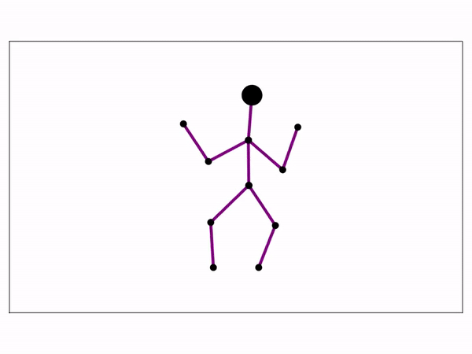

# PickleRick.jl

Julia package for simulation and controls of a 10-link planar humanoid with pinned feet. 

This package uses [WGLMakie.jl]() for visualization in the browser. You can also view the visualizations in a Jupyter notebook.

## Installation
1. Open your Julia REPL by typing  `julia` in your terminal.
2. Press `]` on your keyboard to enter the package manager
3. Enter command `add https://github.com/adubredu/PickleRick.jl"` and press 
`Enter` on your keyboard to install this package.
4. Press the `Backspace` key on your keyboard to return to the REPL

## Usage
See the [examples](examples) folder for usage examples.